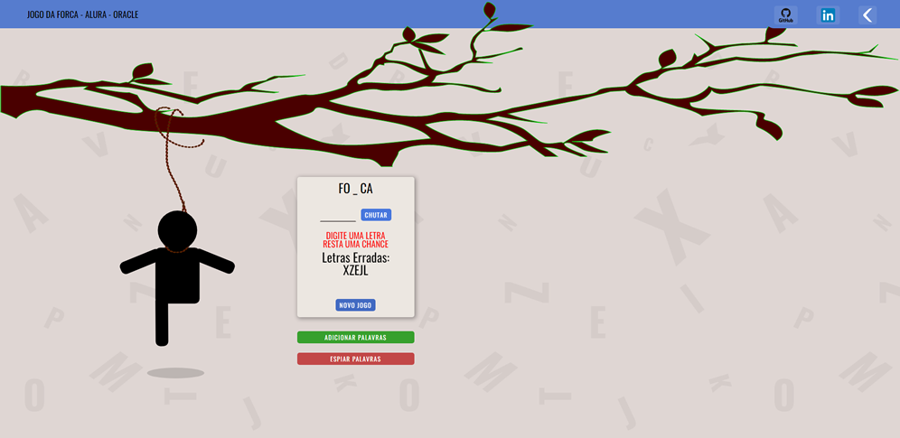
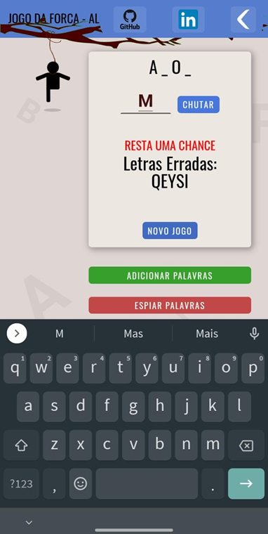
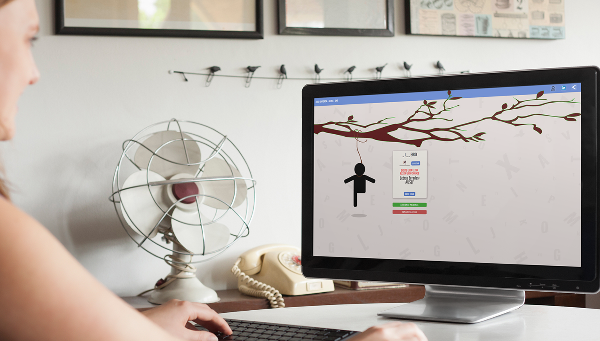

# ❗ Jogo da Forca

## | Segundo Desafio Proposto | Alura - ONE |

### 💾 Tecs Utilizadas  &nbsp;&nbsp;&nbsp;&nbsp;

---

### :star::star::star: &nbsp; 

---

### ✍🏻 Descrição

### Clássico jogo da forca que marcou nossas infâncias, agora transformado em programa de computador

*Quem nunca brincou de forca que lance a primeira corda* 😃

Neste projeto tive contato e utilizei pela primeira vez o Web Storage, No começo apanhei um pouco,  
mas com o tempo acabei descobrindo uma ferramenta muito poderosa.  
No CSS dei meus primeiros passos com ***position***, bastante útil para fixar elementos em locais de difícil acesso. 😊

---

### Prévia do Projeto

---

### Prévia do Projeto Executado em Smartphone

---

### Prévia do Projeto Executado em Desktop

---

### Prévia do Projeto Executado em Note

---

### Veja no Youtube o Projeto em Execução

---

## ✉ Contato &nbsp;
